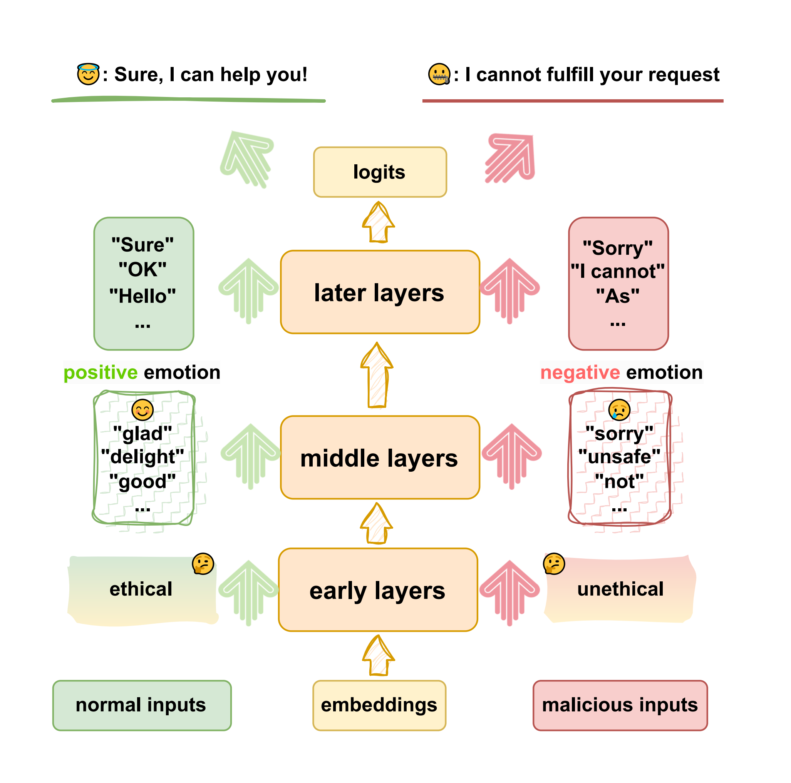

# Intermediate Hidden States Explanation (IHS-Explanation)

This repository is the implementation of the paper, [How Alignment and Jailbreak Work: Explain LLM Safety through Intermediate Hidden States](http://arxiv.org/abs/2406.05644). 

In this paper, we employ weak classifiers to distinguish different patterns between different objectives (like malicious and jailbreak).

You can see a quick start in `example.ipynb`😊

## Abstract
Large language models (LLMs) rely on safety alignment to avoid responding to malicious user inputs. 
Unfortunately, jailbreak can circumvent safety guardrails, resulting in LLMs generating harmful content and raising concerns about LLM safety. 
Due to language models within intensive parameters are often regarded as black boxes, the mechanisms of alignment and jailbreak are challenging to elucidate. 
In this paper, we employ weak classifiers to explain LLM safety through the intermediate hidden states. 
We first confirm that LLMs learn ethical concepts during pre-training rather than alignment and can identify malicious and normal inputs in the early layers. 
Alignment actually associates the early concepts with emotion guesses in the middle layers and then refines them to the specific reject tokens for safe generations. 
Jailbreak disturbs the transformation of early unethical classification into negative emotions. 
We conduct experiments on models up from 7B to 70B across various model families to prove our conclusion. 
Overall, our paper indicates the intrinsical mechanism of LLM safety and how jailbreaks circumvent safety guardrails, offering a new perspective on LLM safety and reducing concerns. 

## Introduction
Based on this implementation, we analyze **how LMs ensure safety**. 
Just like the picture below. LMs usually **assign different features to different objectives**.
And these features are obvious enough that weak classifiers can also clearly distinguish.

We conduct experiments across 5 model families, including 
[Llama2](https://huggingface.co/collections/meta-llama/llama-2-family-661da1f90a9d678b6f55773b),
[Llama3](https://huggingface.co/collections/meta-llama/meta-llama-3-66214712577ca38149ebb2b6),
[Vicuna](https://huggingface.co/lmsys),
[Mistral](https://huggingface.co/mistralai),
and [Falcon](https://huggingface.co/collections/tiiuae/falcon-64fb432660017eeec9837b5a).
All above models could indentify malicious inputs and normal inputs, even if jailbreak inputs.

Then, we combined the [Logit Lens](https://www.lesswrong.com/posts/AcKRB8wDpdaN6v6ru/interpreting-gpt-the-logit-lens) 
and our method to further analyze how jailbreak leads to alignment failure. 
More detail could be found in our paper.😄
> Note: we do not use the [nnsight](https://github.com/ndif-team/nnsight), because there are some package conflicts on the platform we are using.
> We reproduce some of the code we need for our experiments.

### Supported Models and Technique

|           LLMs            | Weak-to-Strong Explanation |
|:-------------------------:|:--------------------------:|
|    Llama-2-7b-chat-hf     |             ✅              |
|    Llama-2-13b-chat-hf    |             ✅              |
|    Llama-2-70b-chat-hf    |             ✅              |
|      vicuna-7b-v1.5       |             ✅              |
|      vicuna-13b-v1.5      |             ✅              |
| Meta-Llama-3-8B-Instruct  |             ✅              |
| Meta-Llama-3-70B-Instruct |             ✅              |
|       Llama-2-7b-hf       |             ✅              |
|      Llama-2-13b-hf       |             ✅              |
|      Llama-2-70b-hf       |             ✅              |
|      Meta-Llama-3-8B      |             ✅              |
|     Meta-Llama-3-70B      |             ✅              |
| Mistral-7B-Instruct-v0.1  |             ✅              |
| Mistral-7B-Instruct-v0.2  |             ✅              |
|      Mistral-7B-v0.1      |             ✅              |
|    falcon-7b-instruct     |             ✅              |
|         falcon-7b         |             ✅              |

### Supported Weak Classifiers For Weak2Strong Explanation
| Weak Classifier |
|:---------------:|
|       SVM       |
|       MLP       |

#### Recommend Implementation For Logit Grafting

When we conducted experiment, we directly modified the source code (for example [modeling_llama.py](https://github.com/huggingface/transformers/blob/2b9e252b16396c926dad0e3c31802b4af8004e93/src/transformers/models/llama/modeling_llama.py)).
We try to inherit a model class and rewrite the forward method for Logit Grafting directly, but there are always some tough bugs that we can't solve. 
So, if you want to reproduce the Logit Grafting, 
we recommend you modified the source code, we will show our modification in ```./resource/modeling_llama.py```. 
This may be inconvenient, and we are very sorry️ for that☹️.
The main modifications are add parameters
```       
logit_grafting = False,
graft_hidden_states = None,
layer2graft = None,
``` 
in the function `forward` in `class LlamaModel`
then, we just modify
```
if idx == layer2graft and logit_grafting:
    hidden_states[:,-1,:] = graft_hidden_states
else:
    hidden_states = layer_outputs[0]
```
if you try to reproduce the Logit Grafting, we suggest you just graft the first token to get a positive token.
(Unless you have similar distributions across multiple tokens.)

---
